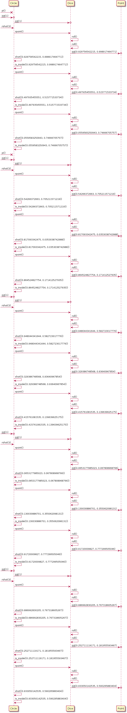

=====
About
=====

Have you ever dreamed with automagically plotting method calls in your code by just running it? Wouldn't be that really cool for tracing your code? 

Here you are a damn simple tool for that!

Requirements
============

* plantuml_

.. _plantuml: https://pypi.python.org/pypi/plantuml

Usage
=====

Just decorate your methods, functions or classes:

.. literalinclude:: example.py

And run your code. A .log file will be generated with the plantuml syntax.

.. literalinclude:: autouml.log

And also an image with the drawn diagram.

